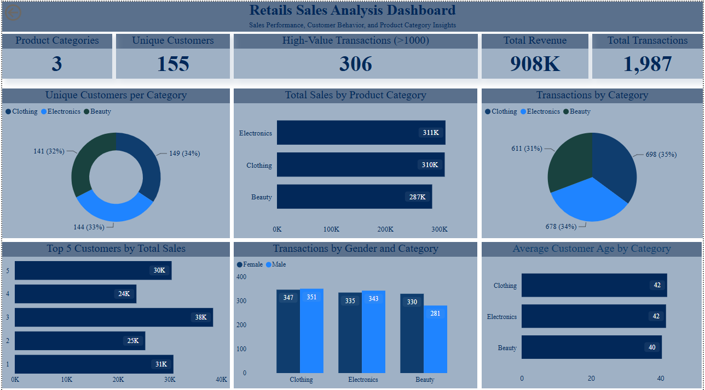

# Retail Sales Analysis | SQL, Power BI & Excel

An end-to-end retail sales analysis project that uses MySQL, Microsoft Excel and Power BI to turn transaction-level data into clear, decision-focused reporting.

The project explores sales performance, product-category trends and customer purchasing patterns. It demonstrates a practical analytics workflow: preparing data, querying it with SQL, interpreting the results and presenting them in an interactive dashboard.

## Dashboard Preview

> The interactive Power BI report is included as [`retail_sales_analysis_dashboard.pbix`](retail_sales_analysis_dashboard.pbix). Open it with Power BI Desktop to explore the report.

## Project Objective

To help a retail business understand where sales are coming from and identify patterns that can support decisions on product focus, customer targeting, promotions, stock planning and operational coverage.

## Business Questions Explored

- How many transactions, customers and product categories are represented in the data?
- Are there incomplete records that need to be addressed before analysis?
- Which product categories generate the highest sales and order volumes?
- Which customers are the highest spenders?
- How are transactions distributed across gender and product category?
- Which transactions are high value, and where may focused commercial attention be useful?

## Analysis Approach

1. **Data preparation** - Reviewed the source data and corrected the `quantiy` and transaction-ID column names for analysis.
2. **Data-quality checks** - Checked for missing values and duplicate transaction IDs, then set the transaction ID as the primary key.
3. **SQL analysis** - Used MySQL to explore records, customers, categories, sales values and purchasing patterns.
4. **Dashboard reporting** - Created a `retail_dashboard` view and built a Power BI dashboard to communicate the findings visually.

## Key Analysis Outputs

The SQL analysis and Power BI dashboard provide the following decision-ready views:

- Category-level sales and order performance
- Total records, unique customers and available product categories
- Transactions made on 5 November 2022, including the transaction count for that date
- Clothing transactions with quantities above four during November 2022
- High-value transactions, defined in the analysis as sales above 1,000
- Top five customers by cumulative sales value
- Customer counts by product category and purchasing patterns by gender
- Average age of customers purchasing from the Beauty category

These outputs show how transaction data can be converted into a concise retail-performance view. The dashboard image above provides a visual summary; the Power BI file contains the interactive report.

## Business Recommendations

- **Focus stock and promotions on proven demand:** use the category sales and order results to prioritise replenishment and campaign attention.
- **Prioritise high-performing categories:** compare sales and order volume by category when allocating promotional budget and replenishment attention.
- **Develop customer-led activity:** use the highest-spending-customer and category-customer views to inform retention, loyalty or targeted campaign ideas.
- **Review high-value purchases:** investigate the products, categories and customer groups associated with transactions above 1,000 to identify opportunities for premium offers or cross-selling.
- **Validate data before reporting:** retain the duplicate, null and column-name checks whenever new data is added so dashboard results remain reliable.

## Tools Used

| Tool | Use in this project |
| --- | --- |
| **MySQL** | Data querying, cleaning checks and exploratory analysis |
| **Microsoft Excel** | Initial data review and preparation |
| **Microsoft Power BI** | Dashboard development and visual communication of findings |

## Skills Demonstrated

- SQL querying and aggregation
- Data-quality checks and data cleaning
- Exploratory data analysis
- Sales and customer analysis
- Time-based and category-based performance analysis
- Power BI dashboard development
- Excel-based data preparation
- Translating analysis into business recommendations

## Repository Contents

All project files are currently stored in the repository root.

| File | Description |
| --- | --- |
| [`README.md`](README.md) | Project documentation |
| [`retail-sales-data.csv`](retail-sales-data.csv) | Source retail sales dataset |
| [`retail-sales-analysis.sql`](retail-sales-analysis.sql) | SQL queries used for data checks and analysis |
| [`retail_sales_analysis_dashboard.pbix`](retail_sales_analysis_dashboard.pbix) | Interactive Power BI dashboard file |
| [`dashboard_image.png`](dashboard_image.png) | Dashboard preview used above |
| [`Retail_Sales_Analysis_Project_Summary.docx`](Retail_Sales_Analysis_Project_Summary.docx) | Supporting project summary |
| [`LICENSE`](LICENSE) | MIT licence |

## How to Explore the Project

1. Download or clone the repository.
2. Review the source data in `retail-sales-data.csv`.
3. Open `retail-sales-analysis.sql` in MySQL and run the queries against the prepared data.
4. Open `retail_sales_analysis_dashboard.pbix` in Power BI Desktop to interact with the dashboard.

## Author

**Ahmed Adebowale Akeeb**  
[GitHub profile](https://github.com/ahmedadebowale6-alt)

---

*Portfolio project created to demonstrate practical SQL, Excel and Power BI skills for data, reporting, business and operations analyst opportunities.*
